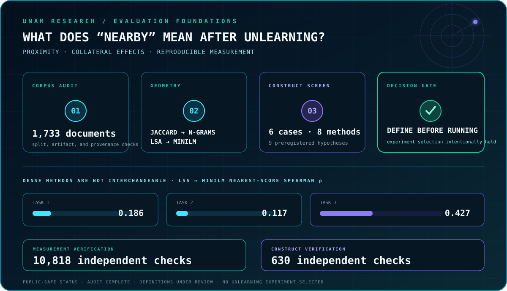

<div align="center">
  
</div>

<p align="center">
  <a href="#research">
    
  </a>
  <a href="#selected-work">
    
  </a>
  <a href="https://www.linkedin.com/in/hamza-raheel-829001319/">
    
  </a>
  <a href="mailto:hamzaprofessionalwork@gmail.com">
    
  </a>
</p>

<h3 align="center">Research engineering for difficult data and systems that have to work.</h3>

<p align="center">
  I work across machine-learning evaluation, computer vision, reproducible
  experimentation, and full-stack software. I am most interested in the point
  where a clean benchmark stops being trustworthy: domain shift, leakage,
  ambiguous metrics, constrained data, and deployment.
  <br/><br/>
  <strong>BS Computer Science · FAST-NUCES Lahore · Class of 2028</strong>
</p>

<p align="center">
  <kbd>RESEARCH ENGINEERING</kbd>
  &nbsp;
  <kbd>COMPUTER VISION</kbd>
  &nbsp;
  <kbd>LLM EVALUATION</kbd>
  &nbsp;
  <kbd>SOFTWARE SYSTEMS</kbd>
</p>

> **Open to:** research collaborations, research-engineering internships, and
> ML systems work where evaluation and reliability matter.

<br/>

<a id="research"></a>
<p align="center"><sub>01 / RESEARCH</sub></p>

<h2 align="center">Two active tracks. One standard: evidence before confidence.</h2>

<table>
  <tr>
    <td width="50%" valign="top">
      <h3>LABUST / University of Zagreb FER</h3>
      <strong>Underwater detection under domain shift</strong>
      <br/><br/>
      Rebuilt a leakage-prone evaluation into a video-disjoint benchmark,
      measured annotation efficiency across five budgets and three seeds, and
      developed retention-constrained adaptation that improves target-domain
      performance without discarding source capability.
      <br/><br/>
      <code>ACTIVE RESEARCH · COMPUTER VISION</code>
    </td>
    <td width="50%" valign="top">
      <h3>Universidad Nacional Autónoma de México</h3>
      <strong>Evaluation foundations for LLM unlearning</strong>
      <br/><br/>
      Auditing datasets, scorers, and proximity measures before selecting an
      unlearning experiment. The current work separates lexical, syntactic,
      semantic, and neural-representation claims and preserves failed
      construct checks instead of tuning around them.
      <br/><br/>
      <code>ACTIVE RESEARCH · LLM EVALUATION</code>
    </td>
  </tr>
</table>

<p align="center">
  <code>Lahore, Pakistan</code>
  &nbsp;·&nbsp;
  <code>reproducible experiments</code>
  &nbsp;·&nbsp;
  <code>public-safe reporting</code>
</p>

<br/>

<p align="center"><sub>02 / LABUST FIELD RESULT</sub></p>

<h2 align="center">Underwater detection under pool → sea domain shift.</h2>

<p align="center">
  The collaboration began with a detector that performed well on its released
  split but did not generalize to the outdoor sea-floor pool. The first task
  was therefore not architecture selection; it was rebuilding the measuring
  instrument.
</p>

<div align="center">
  
</div>

A 15-run annotation-efficiency study—five budgets and three seeds each—found
the strongest target-domain mean at **128 annotated frames: 0.2015 ± 0.0042
mAP50-95**. Using all 524 labelled frames scored lower at **0.1905 ± 0.0072**,
showing that frame selection mattered more than raw annotation volume beyond
the 128-frame point.

The model-of-record result remains the independently repeated eight-frame
effect: **0.0454 → 0.1427 ± 0.0152**, roughly **3.1×**. The budget-128 blend
reached **0.2071** on target validation but retained **0.5449** on the source
domain, below the predeclared **0.5530** floor. No new model was promoted, and
the sealed tests remained closed.

<details>
  <summary><strong>Open the research record</strong></summary>
  <br/>

```text
DATA AUDIT
├── 2,646 delivered exports
├── 1,206 distinct source frames across 17 videos
└── 97.2% of validation frames were near adjacent training frames

CORRECTED EVALUATION
├── one canonical export per source frame
├── complete-video split assignment
└── zero video overlap across train, validation, and sealed tests

ADAPTATION
├── target labels + class-balanced public replay
├── frozen-backbone training + checkpoint interpolation
└── target improvement gated by source retention

CURRENT CONSTRAINT
├── plastic remains 0.0000 across all annotation budgets
├── existing labels come from two redundant scenes
└── scene-diverse capture is the identified data dependency
```

The private workspace contains protocols, hashes, metrics, failure records,
and curated evidence. Images, model weights, correspondence, and sealed-test
material remain outside this public profile.

</details>

<br/>

<p align="center"><sub>03 / UNAM EVALUATION FOUNDATIONS</sub></p>

<h2 align="center">Define “nearby” before measuring selective forgetting.</h2>

<p align="center">
  The UNAM collaboration examines how forgetting one fact can affect nearby
  retained knowledge. The current phase is deliberately definitions-first:
  audit the evidence, validate the measurements, and only then choose a model,
  benchmark, intervention, and estimand.
</p>

<div align="center">
  
</div>

The completed measurement sprint compares Jaccard, character and token
n-gram TF-IDF, LSA, and pinned MiniLM encodings across **1,733 documents**.
LSA and MiniLM are not interchangeable: task-level nearest-score Spearman
correlations are **0.186, 0.117, and 0.427**. Long-input handling also matters;
chunk aggregation changes Task-3 geometry while leaving Tasks 1–2 effectively
unchanged.

A separate controlled screen uses **six frozen content cases, eight methods,
and nine preregistered directional hypotheses**. The shallow syntax measures
pass their current screen, while LSA and MiniLM support broad semantic
relatedness but fail the stricter semantic-equivalence and role-reversal gates.
Those failures are retained as results. No unlearning sweep has been selected
or run from this foundation work.

<details>
  <summary><strong>Open the current decision boundary</strong></summary>
  <br/>

| Completed | Deliberately unresolved |
|---|---|
| Public-data and artifact audit | Primary forgetting level and estimand |
| Lexical, sparse, dense, and neural geometry comparison | Final definitions of proximity constructs |
| Controlled syntax and semantic screens | Benchmark, model, and unlearning method |
| 10,818 measurement checks and 630 construct checks | Official scoring unavailable to collaborators |
| Reproducible public-safe package | First bounded experiment after team agreement |

This status distinguishes completed audit work from experimental claims. It
does not imply publication, institutional endorsement, or a finished
unlearning study.

</details>

<br/>

<a id="selected-work"></a>
<p align="center"><sub>04 / PUBLIC REPOSITORIES</sub></p>

<h2 align="center">Research discipline, product systems, and real-time software.</h2>

<table>
  <tr>
    <td width="50%" valign="top">
      <h3><a href="https://github.com/hamzamaverick51/Dual-Finance-Tool">Dual Finance Tool ↗</a></h3>
      <code>FASTAPI · SUPABASE · JINJA2 · GEMINI</code>
      <br/><br/>
      Internship build combining tax, installment, and reverse-finance flows
      with session-based authentication, persisted user history, enterprise
      finance API calls, and generated explanations. The repository documents
      an AWS Lambda/API Gateway and S3/CloudFront deployment path.
    </td>
    <td width="50%" valign="top">
      <h3><a href="https://github.com/hamzamaverick51/GradientVision">GradientVision ↗</a></h3>
      <code>PYTHON · SYMPY · NUMPY · SCIKIT-LEARN · PLOTLY</code>
      <br/><br/>
      A mathematical analysis assistant with symbolic gradients and Hessians,
      numerical verification, critical-point classification, natural-language
      query handling, and 2D/3D visualizations.
    </td>
  </tr>
  <tr>
    <td width="50%" valign="top">
      <h3><a href="https://github.com/hamzamaverick51/Ballistic-Drift">Ballistic Drift ↗</a></h3>
      <code>C++ · RAYLIB · GAME AI · REAL-TIME GRAPHICS</code>
      <br/><br/>
      A systems-heavy Pong reinterpretation with local PvP, adaptive CPU
      difficulty, collision handling, particles, ripples, screen shake,
      reactive weather, audio states, and persistent high scores.
    </td>
    <td width="50%" valign="top">
      <h3><a href="https://github.com/hamzamaverick51/360-SPACE-SHOOTER">360 Space Shooter ↗</a></h3>
      <code>C++ · SFML · TEAM PROJECT</code>
      <br/><br/>
      A team-built 2D shooter centered on free-direction movement, mouse-aimed
      projectiles, enemy spawning, collision detection, scoring, sound, and
      frame-rate control. The public repository currently documents the design,
      controls, contributors, and setup rather than publishing the source.
    </td>
  </tr>
</table>

<br/>

<p align="center"><sub>05 / INDUSTRY + TEAM ENGINEERING</sub></p>

<h2 align="center">From APIs and deployment to multi-role university systems.</h2>

<table>
  <tr>
    <td width="50%" valign="top">
      <h3>NETSOL Technologies</h3>
      <strong>Software Engineering Intern · 2025</strong>
      <br/><br/>
      Built microservices with AWS Lambda and API Gateway, integrated Supabase
      authentication and PostgreSQL-backed persistence, developed FastAPI
      business APIs, containerized services with Docker, and connected a
      Jinja-based frontend to S3/CloudFront hosting.
      <br/><br/>
      <sub>FASTAPI · POSTGRESQL · SUPABASE · DOCKER · AWS</sub>
    </td>
    <td width="50%" valign="top">
      <h3>ARCH Student Portal</h3>
      <strong>FAST-NUCES team software project · 2026</strong>
      <br/><br/>
      Helped build a React/Vite portal that unifies registration, grading,
      attendance, role-based access, and approval workflows previously spread
      across multiple university systems, backed by live REST APIs and database
      pipelines.
      <br/><br/>
      <sub>REACT · VITE · NODE.JS · DATABASES · RBAC</sub>
    </td>
  </tr>
</table>

<p align="center">
  <sub>
    These descriptions state work performed. They do not imply publication,
    institutional endorsement, or completion beyond the status shown.
  </sub>
</p>

<br/>

<p align="center"><sub>06 / RESEARCH ATLAS</sub></p>

<h2 align="center">Different domains. The same question about hidden failure.</h2>

<div align="center">
  
</div>

| Failure mode | Research thread | Current status |
|---|---|---|
| **Domain shift** | Pool-to-sea underwater object detection | `MEASURED METHOD · DATA DEPENDENCY IDENTIFIED` |
| **Evaluation leakage** | Video-adjacent underwater benchmark splits | `AUDITED · REBUILT` |
| **Construct ambiguity** | Lexical, syntactic, semantic, and neural proximity | `CONTROLLED SCREEN COMPLETE` |
| **Selective forgetting** | Collateral effects in LLM unlearning | `DEFINITIONS + EXPERIMENT DECISION` |

<br/>

<p align="center"><sub>07 / TECHNICAL BACKBONE</sub></p>

<h2 align="center">One stack across research and product engineering.</h2>

<p align="center">
  
</p>

<details>
  <summary><strong>Open the technical inventory</strong></summary>
  <br/>

```yaml
research_computing:
  - PyTorch, Ultralytics, OpenCV
  - NumPy, scikit-learn, SciPy, SymPy
  - dataset audits, controlled experiments, artifact verification
  - per-class, per-domain, and failure-mode evaluation

software_systems:
  - Python, FastAPI, Jinja2, REST APIs
  - TypeScript, React, Node.js
  - PostgreSQL, Supabase, MongoDB
  - Docker, Linux, AWS serverless infrastructure

systems_programming:
  - C++, Raylib, SFML
  - collision systems, game AI, input, audio, and real-time effects
```

</details>

<br/>

<p align="center"><sub>08 / OPERATING PRINCIPLES</sub></p>

<h2 align="center">Ambitious questions. Precise claims.</h2>

<table>
  <tr>
    <td width="50%" valign="top">
      <h3>Optimize for</h3>
      Evidence before confidence<br/>
      Reproducible runs before screenshots<br/>
      Failure analysis before architecture shopping<br/>
      Clean interfaces before clever abstractions<br/>
      Work another person can inspect
    </td>
    <td width="50%" valign="top">
      <h3>Avoid</h3>
      Invented percentages<br/>
      Test leakage presented as performance<br/>
      “AI-powered” without a measurable job<br/>
      Activity confused with progress<br/>
      Confidence unsupported by evidence
    </td>
  </tr>
</table>

<p align="center">
  
</p>

---

<div align="center">

<sub>CONNECTION REQUEST</sub>

## Let’s build something that has to work.

I am interested in computer vision in difficult environments, scientific
machine learning, LLM evaluation, autonomous systems, and software whose claims
survive contact with reality.

[**GitHub**](https://github.com/hamzamaverick51?tab=repositories)
&nbsp;·&nbsp;
[**LinkedIn**](https://www.linkedin.com/in/hamza-raheel-829001319/)
&nbsp;·&nbsp;
[**Email**](mailto:hamzaprofessionalwork@gmail.com)

<br/>

`Lahore, Pakistan` · `research with receipts` · `systems that ship`

</div>
