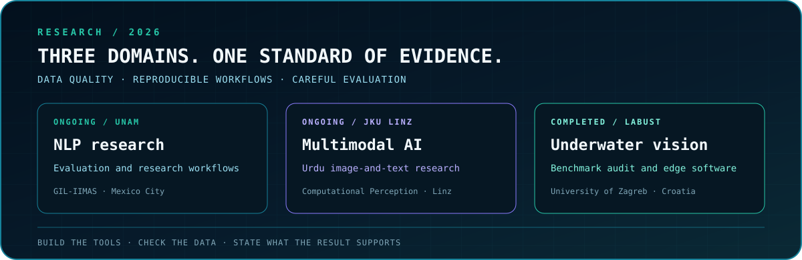

  

  
  
  
  
  

<h3 align="center">ML research, reliable evaluation, and software that makes the work usable.</h3>

  I am a computer science student at FAST-NUCES working across computer vision,
  NLP, multimodal data, and software engineering. I build research tools, audit
  data and measurements, and turn results into claims another person can check.
    
  <strong>BS Computer Science · FAST-NUCES Lahore · Expected 2028</strong>

  <kbd>ML EVALUATION</kbd> &nbsp; <kbd>COMPUTER VISION</kbd> &nbsp;
  <kbd>MULTIMODAL DATA</kbd> &nbsp; <kbd>SOFTWARE SYSTEMS</kbd>

> **Open to:** research collaborations, research-engineering internships, and
> ML systems work where evaluation and reliability matter.

 

01 / RESEARCH

<h2 align="center">Research across language, vision, and multimodal data.</h2>

  

<table>
  <tr>
    <td width="50%" valign="top">
      <h3>GIL-IIMAS · UNAM</h3>
      <strong>Research Collaborator · Aug 2026–present</strong>
        
      Working with Karla Salas-Jiménez, Francisco F. López-Ponce, and Diego
      Hernández-Bustamante under Dr. Helena Gómez Adorno on an ongoing NLP
      research collaboration. My contributions include evidence review, data
      analysis, evaluation design, and reproducible research workflows.
        
      <code>ONGOING · NLP RESEARCH</code>
    </td>
    <td width="50%" valign="top">
      <h3>Johannes Kepler University Linz</h3>
      <strong>Research Collaborator · Aug 2026–present</strong>
        
      Collaborating with Dr. Shah Nawaz at the Institute of Computational
      Perception on Urdu-language multimodal AI research. I contribute to
      dataset quality assessment and reproducible workflows for image-and-text
      data, including tools that support collection, organization, and review.
        
      <code>ONGOING · MULTIMODAL AI</code>
    </td>
  </tr>
</table>

 

02 / COMPLETED RESEARCH CASE STUDY

<h2 align="center">Beneath the Benchmark: underwater vision at LABUST.</h2>

  July–September 2026 · Laboratory for Underwater Systems and Technologies,
  FER, University of Zagreb · Remote collaboration

The project began with underwater object detection under a shift from controlled
imagery to outdoor recordings. The most useful result was an audit of what the
supplied data could actually measure: **2,646 exports mapped to 1,206 distinct
frames from 17 videos**, and all 17 videos appeared on both sides of the
delivered training/evaluation split. Those counts describe that export, not an
unpublished paper split.

I traced video and frame lineage, built provisional video-separated partitions,
ran controlled detector studies, developed a Python-free C++/NCNN inference
path with ARM builds, and assembled an offline review package. That package
placed **704 candidate issues across 636 frames** in a human-review queue.
The inference software passed a 1,000-frame desktop stability test; physical
Raspberry Pi and ROV performance were not measured.

Later review found unresolved image-orientation and annotation issues. The
historical model comparisons remain useful diagnostics, but they do not support
a certified final detector-accuracy claim. The public case study keeps the
audit, engineering work, and evidence limits together.

  <a href="https://github.com/hamzamaverick51/Beneath-The-Benchmark"><strong>Read the public case study →</strong></a>
  &nbsp;·&nbsp;
  <a href="https://hamzamaverick51.github.io/Beneath-The-Benchmark/">Explore the visual story →</a>

 

03 / INDUSTRY ENGINEERING

<h2 align="center">AI workflows and software for real users.</h2>

<table>
  <tr>
    <td width="50%" valign="top">
      <h3>NETSOL Technologies · 2026</h3>
      <strong>AI/ML Intern, Scientific Computing</strong>
        
      Developed retrieval-augmented chat with speech input and output, plus
      authenticated AI-agent workflows for financial-document and database
      tasks. Worked on image classification, signature-forgery detection,
      application guardrails, and components of a credit-risk pipeline under
      the supervising AI/ML engineer.
        
      PYTHON · RAG · AI WORKFLOWS · COMPUTER VISION
    </td>
    <td width="50%" valign="top">
      <h3>NETSOL Technologies · 2025</h3>
      <strong>Software Engineering Intern, UNITY</strong>
        
      Built FastAPI services and serverless endpoints with AWS Lambda and API
      Gateway. Integrated Supabase authentication and PostgreSQL persistence,
      containerized services with Docker, and connected a Jinja-based frontend
      to S3/CloudFront delivery.
        
      FASTAPI · POSTGRESQL · SUPABASE · DOCKER · AWS
    </td>
  </tr>
</table>

 

04 / SELECTED SOFTWARE

<h2 align="center">Research-minded builds, useful products, and real-time systems.</h2>

<table>
  <tr>
    <td width="50%" valign="top">
      <h3><a href="https://github.com/hamzamaverick51/Dual-Finance-Tool">Dual Finance Tool ↗</a></h3>
      <code>FASTAPI · SUPABASE · JINJA2 · GEMINI</code>
        
      A financial-planning application combining tax, installment, and reverse
      planning flows with authenticated history, external finance APIs, and
      generated explanations. Built during my 2025 NETSOL internship.
    </td>
    <td width="50%" valign="top">
      <h3><a href="https://github.com/hamzamaverick51/GradientVision">GradientVision ↗</a></h3>
      <code>PYTHON · SYMPY · NUMPY · SCIKIT-LEARN · PLOTLY</code>
        
      A mathematical analysis assistant with symbolic and numerical gradients,
      critical-point classification, natural-language queries, and interactive
      2D/3D visualization.
    </td>
  </tr>
  <tr>
    <td width="50%" valign="top">
      <h3><a href="https://github.com/ARCH-Student-Portal/ARCH-Student-Portal">ARCH Student Portal ↗</a></h3>
      <code>REACT · NODE.JS · DATABASES · RBAC</code>
        
      A team-built university portal for registration, grading, attendance,
      and role-based workflows. I worked on system design and the interfaces
      connecting student-facing pages to live APIs.
    </td>
    <td width="50%" valign="top">
      <h3><a href="https://github.com/hamzamaverick51/Ballistic-Drift">Ballistic Drift ↗</a></h3>
      <code>C++ · RAYLIB · GAME AI · REAL-TIME GRAPHICS</code>
        
      A Pong reinterpretation with local multiplayer, adaptive CPU opponents,
      collision handling, reactive effects, audio states, and persistent high
      scores.
    </td>
  </tr>
</table>

 

05 / TECHNICAL BACKBONE

<h2 align="center">Tools for experiments and applications.</h2>

  

  
<strong>Open the technical inventory</strong>

   

| Area | Tools and practices |
|---|---|
| Research computing | Python, PyTorch, NumPy, scikit-learn, OpenCV; dataset audits, controlled experiments, reproducible evaluation |
| Applications and APIs | FastAPI, React, Node.js, REST APIs, PostgreSQL, Supabase, authentication and access control |
| Deployment and systems | C++, NCNN, Docker, Linux, AWS Lambda/API Gateway/S3/CloudFront; desktop and ARM compatibility checks |
| Mathematical software | SymPy, numerical methods, classification, interactive visualization |

 

06 / HOW I WORK

<h2 align="center">Make the evidence inspectable.</h2>

  Audit the data before trusting a benchmark. 
  Repeat a promising result before promoting it. 
  Record failures and limitations alongside successes. 
  Build tools another person can run and review.

  

---

CONNECTION REQUEST

## Let’s build something that has to work.

I am interested in computer vision, NLP evaluation, multimodal AI, research
engineering, and software whose claims survive careful testing.

[**Repositories**](https://github.com/hamzamaverick51?tab=repositories)
&nbsp;·&nbsp;
[**LinkedIn**](https://www.linkedin.com/in/hamza-raheel-829001319/)
&nbsp;·&nbsp;
[**Email**](mailto:hamzaprofessionalwork@gmail.com)

 

`Lahore, Pakistan` · `research with receipts` · `systems that ship`

