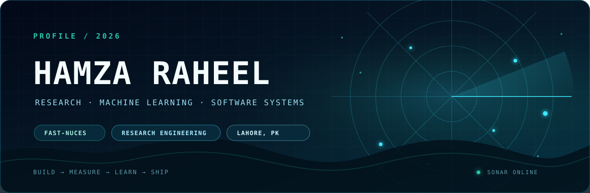
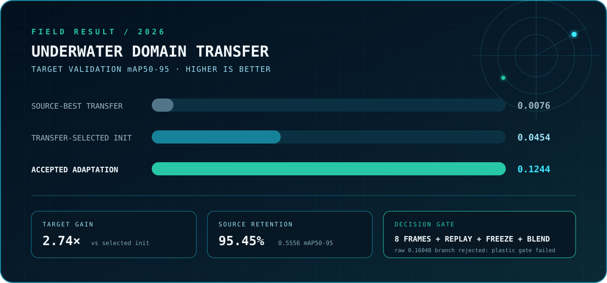
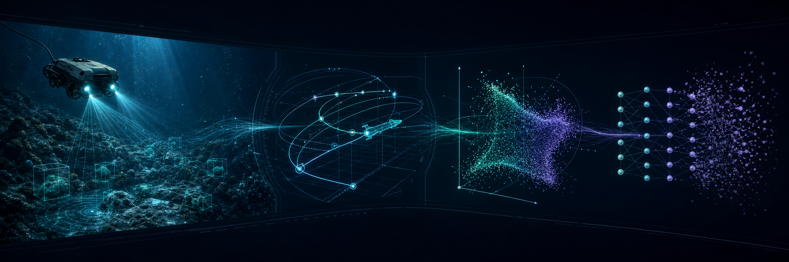

<div align="center">
  
</div>

<p align="center">
  <a href="https://github.com/hamzamaverick51?tab=repositories">
    
  </a>
  <a href="#flagship-result">
    
  </a>
  <a href="#selected-work">
    
  </a>
  <a href="https://www.linkedin.com/in/hamza-raheel-829001319/">
    
  </a>
  <a href="mailto:hamzaprofessionalwork@gmail.com">
    
  </a>
</p>

<h3 align="center">Research engineer in training. Systems builder in practice.</h3>

<p align="center">
  I build machine-learning experiments and software systems for the point where
  clean benchmarks meet messy reality—domain shift, hidden leakage, constrained
  data, and deployment.
  <br/><br/>
  <strong>BS Computer Science · FAST-NUCES Lahore · Class of 2028</strong>
</p>

<p align="center">
  <kbd>RESEARCH ENGINEERING</kbd>
  &nbsp;
  <kbd>COMPUTER VISION</kbd>
  &nbsp;
  <kbd>APPLIED ML</kbd>
  &nbsp;
  <kbd>SOFTWARE SYSTEMS</kbd>
</p>

> **Open to:** research collaborations, research-engineering internships, and
> difficult ML systems where evaluation and reliability actually matter.

<br/>

<p align="center"><sub>01 / CURRENT SIGNAL</sub></p>

<h2 align="center">Build → measure → learn → ship.</h2>

<table>
  <tr>
    <td width="50%" valign="top">
      <h3>🌊 Working on now</h3>
      <strong>Underwater computer vision under domain shift</strong>
      <br/><br/>
      A validated retention-constrained detector is complete. The present
      bottleneck is scene-diverse target-native plastic data—not another blind
      hyperparameter sweep.
    </td>
    <td width="50%" valign="top">
      <h3>🧭 Operating method</h3>
      <strong>Evidence before confidence</strong>
      <br/><br/>
      Predeclare gates, separate videos instead of random frames, retain source
      capability, reject misleading aggregate wins, and leave an auditable path
      from claim to artifact.
    </td>
  </tr>
</table>

<p align="center">
  <code>Lahore, Pakistan</code>
  &nbsp;·&nbsp;
  <code>research with receipts</code>
  &nbsp;·&nbsp;
  <code>systems that ship</code>
</p>

<br/>

<a id="flagship-result"></a>
<p align="center"><sub>02 / FLAGSHIP RESULT</sub></p>

<h2 align="center">Underwater detection that survives pool → sea.</h2>

<p align="center">
  In collaboration with <strong>LABUST / University of Zagreb FER</strong>,
  I am extending an underwater PPE and debris detector beyond its original
  pool-domain evaluation.
</p>

<div align="center">
  
</div>

The accepted method uses only **eight target training frames**, class-balanced
public replay, a frozen backbone, and deterministic checkpoint interpolation.
It improves target validation mAP50-95 from **0.0454 to 0.1244 (2.74×)** while
retaining **0.5556 source validation mAP50-95**.

The highest raw target aggregate was **0.16048**, but I rejected that branch:
plastic mAP50-95 was only **0.00001050**, below the predeclared class gate. The
accepted result is the strongest tested candidate that passed every gate it was
eligible to face—not merely the largest convenient number.

<p align="center">
  <a href="#selected-work">
    
  </a>
  <a href="mailto:hamzaprofessionalwork@gmail.com">
    
  </a>
</p>

<details>
  <summary><strong>Open the research record</strong></summary>
  <br/>

```text
PUBLIC BASELINE
├── TrashCan + SeaClear
├── 12,953 train / 2,869 validation images
└── 100 epochs complete at 0.62437 mAP50-95

DATA AUDIT
├── 2,646 delivered exports
├── 1,206 distinct source frames
└── augmentation + sequence leakage identified

CORRECTED EVALUATION
├── deduplicated by source frame
├── split by complete source video
└── 0 / 17 videos crossing corrected splits

ACCEPTED ADAPTATION
├── 8 local frames + class-balanced public replay
├── frozen backbone + checkpoint interpolation
└── 0.12440 target / 0.55561 source mAP50-95

CURRENT CONSTRAINT
├── plastic labels span only two redundant Blueye videos
├── multiple current-data interventions exhausted
└── scene-diverse Blueye + FiFish capture requested
```

The private collaboration workspace records protocols, audits, metrics, hashes,
and curated evidence. Data, model weights, and correspondence remain outside
the public profile; corrected reporting tests stay sealed during
adaptation-method selection.

</details>

<br/>

<a id="selected-work"></a>
<p align="center"><sub>03 / SELECTED WORK</sub></p>

<h2 align="center">Evidence first. Source where public.</h2>

<table>
  <tr>
    <td width="50%" valign="top">
      <h3><a href="#flagship-result">🌊 LABUST Underwater Detection ↑</a></h3>
      <code>RESEARCH RESULT · PRIVATE COLLABORATION</code>
      <br/><br/>
      YOLO26 transfer learning, dataset forensics, whole-video evaluation,
      public replay, checkpoint interpolation, per-class gates, and a complete
      reproducibility trail.
      <br/><br/>
      <sub>PYTHON · PYTORCH · ULTRALYTICS · OPENCV</sub>
    </td>
    <td width="50%" valign="top">
      <h3><a href="https://github.com/hamzamaverick51/Dual-Finance-Tool">💳 Dual Finance Tool ↗</a></h3>
      <code>INTERNSHIP BUILD · OPEN SOURCE</code>
      <br/><br/>
      Tax and installment planning through enterprise financial APIs, secure
      user history, and Gemini-generated explanations, with a documented AWS
      serverless deployment path.
      <br/><br/>
      <sub>FASTAPI · SUPABASE · GEMINI · AWS</sub>
    </td>
  </tr>
  <tr>
    <td width="50%" valign="top">
      <h3><a href="https://github.com/hamzamaverick51/GradientVision">📐 GradientVision ↗</a></h3>
      <code>SHIPPED · OPEN SOURCE</code>
      <br/><br/>
      Turns natural-language mathematical questions into inspectable symbolic
      and numerical computation, critical-point classification, gradient fields,
      and 2D/3D visualizations.
      <br/><br/>
      <sub>PYTHON · SYMPY · NUMPY · SCIKIT-LEARN · PLOTLY</sub>
    </td>
    <td width="50%" valign="top">
      <h3><a href="https://github.com/hamzamaverick51/Ballistic-Drift">🔥 Ballistic Drift ↗</a></h3>
      <code>SHIPPED · OPEN SOURCE</code>
      <br/><br/>
      A systems-heavy Pong reinvention with adaptive CPU difficulty, local PvP,
      particle and ripple effects, screen shake, reactive weather, audio, and
      persistent high scores.
      <br/><br/>
      <sub>C++ · RAYLIB · GAME AI · REAL-TIME GRAPHICS</sub>
    </td>
  </tr>
</table>

### Engineering case study

At **NETSOL Technologies**, I built the Dual Finance Tool across backend APIs,
authentication, persistence, AI explanations, containers, and cloud deployment
planning. At **FAST-NUCES**, I helped build **ARCH**, a React/Vite student portal
unifying registration, grading, attendance, role-based access, and approval
workflows previously spread across multiple systems. More context is available
on [LinkedIn](https://www.linkedin.com/in/hamza-raheel-829001319/).

<br/>

<p align="center"><sub>04 / RESEARCH ATLAS</sub></p>

<h2 align="center">One question across four failure modes.</h2>

<p align="center">
  How do we identify, measure, and correct failures that clean aggregate
  benchmarks hide?
</p>

<div align="center">
  
</div>

<details>
  <summary><strong>Open the active research atlas</strong></summary>
  <br/>

| Failure mode | Research thread | Current status |
|---|---|---|
| **Domain shift** | Pool-to-sea underwater object detection | `VALID METHOD · DATA ACQUISITION` |
| **Representation error** | Controlled Earth / space-analog data-mixture sweep | `SWEEP DELIVERED` |
| **Stability** | Controller proof auditing, simulation, and parameter regions | `ARTIFACTS UNDER REVIEW` |
| **Selective forgetting** | Representation, semantic, and surface adjacency in LM unlearning | `STUDY DESIGN` |

These are active research threads, not publication claims. Each stays explicitly
qualified by its experimental status.

</details>

<br/>

<p align="center"><sub>05 / ENGINEERING BACKBONE</sub></p>

<h2 align="center">Research ideas matter when the system can ship.</h2>

<table>
  <tr>
    <td width="50%" valign="top">
      <h3>NETSOL Technologies</h3>
      <strong>AI &amp; Machine Learning Intern · 2025</strong>
      <br/><br/>
      Built across FastAPI, REST integrations, Supabase authentication and
      PostgreSQL persistence, Gemini assistance, Docker, and AWS serverless
      infrastructure.
    </td>
    <td width="50%" valign="top">
      <h3>FAST-NUCES Lahore</h3>
      <strong>BS Computer Science · 2024–2028</strong>
      <br/><br/>
      Building foundations across algorithms, AI, operating systems, databases,
      software design, calculus, and linear algebra—and applying them in systems
      that can be inspected and tested.
    </td>
  </tr>
</table>

<p align="center">
  
</p>

<details>
  <summary><strong>Open the technical inventory</strong></summary>
  <br/>

```yaml
research_computing:
  - PyTorch, Ultralytics, OpenCV
  - NumPy, scikit-learn, SymPy
  - reproducible experiments and dataset audits
  - per-class, per-domain, and failure-mode evaluation

software_systems:
  - Python, FastAPI, REST APIs
  - TypeScript, React, Node.js
  - PostgreSQL, Supabase, MongoDB
  - Docker, Linux, AWS serverless infrastructure

systems_programming:
  - C++, Raylib, SFML
  - collision systems, game AI, input, audio, and real-time effects
```

</details>

<br/>

<p align="center"><sub>06 / OPERATING PRINCIPLES</sub></p>

<h2 align="center">Ambitious questions. Precise claims.</h2>

<table>
  <tr>
    <td width="50%" valign="top">
      <h3>Optimize for</h3>
      ✅ Evidence before confidence<br/>
      ✅ Reproducible runs before screenshots<br/>
      ✅ Failure analysis before architecture shopping<br/>
      ✅ Clean interfaces before clever abstractions<br/>
      ✅ Work another person can inspect
    </td>
    <td width="50%" valign="top">
      <h3>Actively avoid</h3>
      ❌ Invented percentages<br/>
      ❌ Test leakage disguised as performance<br/>
      ❌ “AI-powered” without a measurable job<br/>
      ❌ Activity confused with progress<br/>
      ❌ Confidence unsupported by evidence
    </td>
  </tr>
</table>

<p align="center">
  
</p>

---

<div align="center">

<sub>CONNECTION REQUEST</sub>

## Let’s build something that has to work.

I’m interested in computer vision in difficult environments, scientific machine
learning, autonomous systems, and evaluation that survives contact with reality.

[**GitHub**](https://github.com/hamzamaverick51?tab=repositories)
&nbsp;·&nbsp;
[**LinkedIn**](https://www.linkedin.com/in/hamza-raheel-829001319/)
&nbsp;·&nbsp;
[**Email**](mailto:hamzaprofessionalwork@gmail.com)

<br/>

`Lahore, Pakistan` · `research with receipts` · `systems that ship`

</div>
